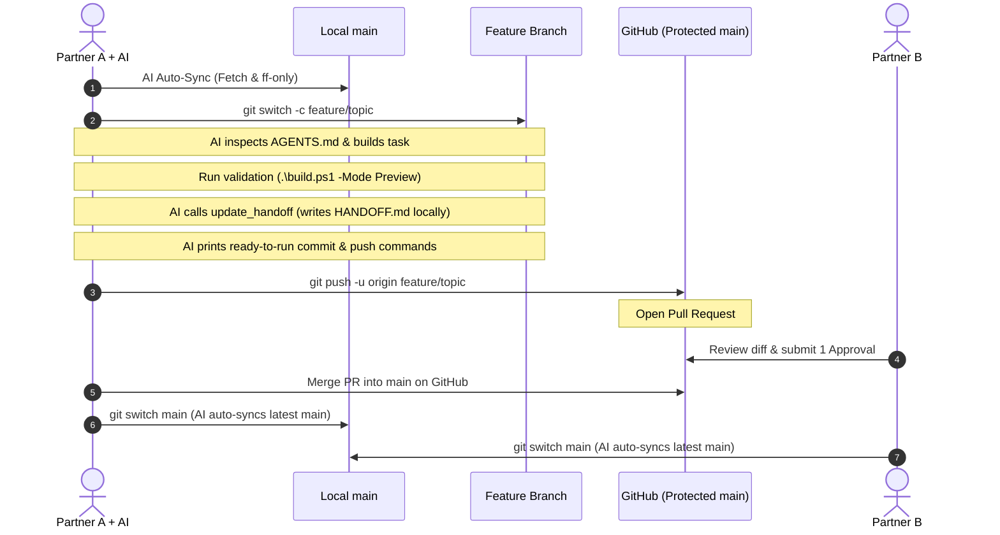

# Client Web Business: Partner Collaboration Protocol

This document establishes the collaboration protocol for multiple humans and AI agents working in this repository.

---

## 1. Golden Rule: The Handoff Baton on `main`

[`HANDOFF.md`](file:///C:/Projects/client-web-business/HANDOFF.md) represents the **current approved, integrated state of `main`**.

It is **not** an append-only diary, and it is **not** continuously updated on separate unfinished task branches. It provides a 30-second operational briefing of what is live, what just changed, and what comes next.

### Automated Start-of-Session Sync
You do **not** need to remember to run manual sync commands before every task:
- **MCP Auto-Sync**: Whenever an AI agent connects via MCP (`get_icm_context` or `safe_sync_workspace`), it automatically fetches origin, verifies that your working tree is clean, and fast-forwards partner commits into your local branch.
- **Manual CLI Fallback**: If you ever want to check or sync manually in PowerShell, run:
  ```powershell
  python .\scripts\sync_session.py
  ```

---

## 2. The 4-Layer Collision Protection Stack

To ensure you and your partner never silently overwrite each other:

| Layer | Mechanism | Protection Provided |
| :--- | :--- | :--- |
| **Layer 1** | Automated MCP Sync / `sync_session.py` | Automatically fetches and fast-forwards partner commits before work begins; prevents surprise merge conflicts. |
| **Layer 2** | Short-Lived Feature Branches | Isolates in-progress work (`feature/<topic>`); keeps unverified experiments off `main`. |
| **Layer 3** | Git Merge Conflicts & PR Approvals | If lines conflict, Git halts. Dual sign-off PRs ensure neither partner alters `main` without review. |
| **Layer 4** | MCP `expected_sha256` Lock | In `mcp_server.py`, if a local file changed since the AI read it, the write is blocked with `STALE_VERSION_CONFLICT`. |

---

## 3. Git Workflow: Feature Branches & Pull Requests

`main` is protected on GitHub: direct pushes are blocked. All changes merge through Pull Requests.



### Mandatory AI Commit & Push Guidance
Whenever an AI assistant modifies project files, it is strictly mandated to conclude the response with the exact copy-paste PowerShell commands:
1. `git switch -c feature/<topic>` (if not already on a feature branch)
2. `git add <changed-files>`
3. `git commit -m "<type>(<scope>): <clear description>"`
4. `git push -u origin feature/<topic>`
5. Direct link to open the Pull Request on GitHub.

You never have to guess what commands to run.

### Standard Session Sequence
```powershell
# 1. Start session (AI auto-syncs behind the scenes)
# Or manually: python .\scripts\sync_session.py

# 2. Create task branch
git switch -c feature/niche-hvac-demo

# 3. Agent performs work and runs local validation
.\build.ps1 -Mode Preview

# 4. Agent updates HANDOFF.md locally via tool update_handoff

# 5. Commit and push feature branch (copy-pasted from AI prompt)
git add <changed-files>
git commit -m "feat(demos): integrate HVAC demo and update handoff"
git push -u origin feature/niche-hvac-demo

# 6. Open Pull Request on GitHub
# Partner reviews diff and provides 1 approving review

# 7. Merge PR into main on GitHub

# 8. Switch to main locally and cleanup branch
git switch main
git branch -d feature/niche-hvac-demo
python .\scripts\sync_session.py
```

### Dual-Sign-Off Rule
To ensure neither partner can silently change `main`:
- **1 Approving Review Required**: Merging requires an approving review from the other partner.
- **Dismiss Stale Approvals**: Pushing new commits automatically invalidates previous approvals so the final code is always the reviewed code.

---

## 4. Scope Separation to Prevent Conflicts

- **Demos**: Work in separate folders under `demos/` when building concurrently (e.g. Angelo on `demos/local-business`, Partner on `demos/dental`).
- **Design & Tokens**: Coordinate before altering global tokens in [`DESIGN.md`](file:///C:/Projects/client-web-business/DESIGN.md).
- **Contracts**: Legal templates in `contracts/` require mutual agreement before modification.
- **Build Output**: `dist/` and `backups/` are ignored by git; each partner compiles locally using `.\build.ps1`.
