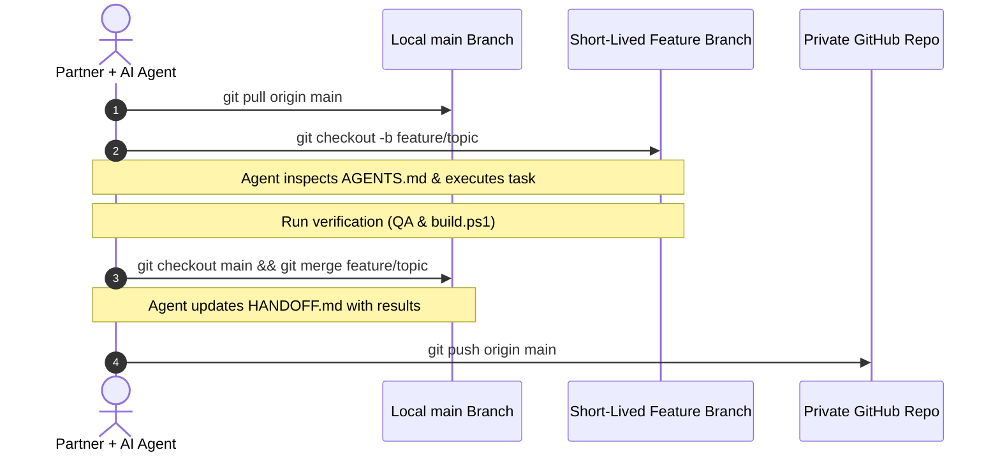

# Vanguard Web Studio: Partner Review & Execution Plan
**Confidential — Internal Partnership & Governance Document**  
**Date**: September 2026  
**Project**: `client-web-business` (Vanguard Web Studio & Vibe Coding Agency)  
**Repository Route**: `C:\Projects\client-web-business`

---

## Executive Summary & Status Scorecard

This document provides the operational blueprint, architecture breakdown, risk boundaries, and collaboration protocol for our joint venture: **Vanguard Web Studio**.

We have developed a modular agency foundation using the **Interpretable Context Methodology (ICM)**. Operational roadmaps, client contract drafts, design tokens, and niche demo sites are isolated into bounded filesystem packets. This architecture allows us and our AI coding assistants (Claude Code, Antigravity, Cursor, Hermes) to collaborate asynchronously with high context fidelity.

### Partner Alignment Scorecard

| Area | Status | Operating Policy |
| :--- | :---: | :--- |
| **Architecture & Structure** | **Approved** | Modular ICM folder layout (`AGENTS.md` $\rightarrow$ `CONTEXT.md` $\rightarrow$ `HANDOFF.md`). |
| **Collaboration Model** | **Approved** | Short-lived feature branch workflow for all code/config changes. |
| **Business Model** | **Approved Baseline** | 3-tier website packages + recurring care retainers + asset flips. |
| **Pricing Ladder** | **Plausible / Requires Validation** | Test $799 / $1,499 / $2,499 against initial local client prospecting. |
| **Legal Agreements** | **Agency-Drafted / Review Recommended** | Independent counsel review recommended prior to first material contract. |
| **Tech & Maintenance** | **Calibrated** | Low-overhead static architecture (no agency-managed app/db servers). |
| **Security Posture** | **Defensible Baseline** | Audit clean at baseline; private repo + strict `dist/` isolation enforced. |
| **Client Launch Readiness** | **Gated** | Sites require 10-point production release gate before live client launch. |

---

## 1. Project Mission & Business Model

### Core Value Proposition
To build, customize, legally safeguard, and sell high-converting, mobile-responsive websites and micro-SaaS web assets to local service businesses and online founders using rapid AI-assisted development (vibe coding) with **minimal server-maintenance overhead** (no agency-managed application servers or databases for standard brochure-site deployments).

### Revenue Streams
1. **Turnkey Client Website Builds** (Initial baseline targets — subject to local market validation):
   - **Launch Ready ($799)**: 1-page high-converting landing page, mobile-first responsive layout, serverless contact form, local SEO meta.
   - **Growth Flagship ($1,499)**: Multi-section commercial site, custom instant quote calculator, emergency dispatch/booking UI, Google Maps integration.
   - **Market Dominator ($2,499)**: Complete commercial presence, multiple landing pages, conversion animations, CRM/intake routing, speed optimization.
2. **Monthly Care & Hosting Retainers**:
   - $149 / $299 / $499 per month recurring revenue per client for edge static hosting, uptime monitoring, minor content edits, and periodic form health checks.
3. **Micro-SaaS & Web Asset Exits**:
   - Developing niche calculators, intake tools, and directory sites.
   - **Exit Valuation Target**: Targeting **3.0x–5.0x annual owner earnings / SDE (Seller's Discretionary Earnings)** where market conditions, organic growth, customer retention, and code quality support such valuations (modeled exit target/hypothesis, subject to market demand and empirical performance).

---

## 2. Asset & Codebase Inventory

### Readiness Distinction
- **Foundation**: **Production-ready** (semantic architecture, design token compliance, cross-browser responsiveness, CSP security headers verified).
- **Client Deployment**: **Requires client-specific configuration and production assets** (form IDs, canonical URLs, real contact details, high-res photography).

### A. Agency Frontend & Client Demos
- **Main Agency Portfolio (`index.html`)**: Live Vanguard Web Studio marketing site featuring service tiers, interactive project cost estimator, client intake modal, and portfolio showcase.
- **Apex Roofing & Remodeling Demo (`demos/local-business/index.html`)**: Amber Gold & Navy themed site with instant roofing quote calculator, trust badges, and 5 conversion sections.
- **BlueFlow Plumbing & Drains Demo (`demos/plumbing/index.html`)**: Cyan & Slate themed emergency dispatch site featuring 45-minute arrival guarantee badge and quick-dial emergency CTAs.
- **Willow Dental Care Demo (`demos/dental/index.html`)**: Clinical Teal & White aesthetic featuring $99 new-patient exam showcase and anxiety-free comfort amenity cards.

### B. Design Token Grammar (`DESIGN.md`)
- Machine-readable design specification enforcing luxury typography (*Inter*, *Plus Jakarta Sans*, *Playfair Display*), strict color contrast ratios, glassmorphism surface elevations, and mobile viewport breakpoints.
- Eliminates generic "AI beige" layouts and ensures code generated by AI agents matches bespoke design agency standards.

### C. Commercial & Legal Agreements (`contracts/`)
- **Master Web Design Agreement (`contracts/web_design_agreement.md`)**: 
  - *Status*: **Agency-drafted commercial agreement — independent legal review recommended before first material client engagement.**
  - Includes: 50% upfront deposit terms, strict 2-round revision caps to prevent scope creep, bifurcated limitation of liability (capped at total contract value), and IP ownership assignment strictly conditioned upon 100% final invoice payment.
  - *Cross-Border Advisory*: Legal counsel review is specifically advised to address cross-border enforcement, governing law, jurisdiction, and tax obligations when serving U.S. clients from overseas operations.
- **Client Proposal & Scope Sheet (`contracts/client_proposal_and_scope_template.md`)**: 1-page commercial proposal template to generate fixed-scope quotes in under 10 minutes.

### D. Operational & Sales Playbooks
- **7-Phase Sales & Delivery Roadmap (`COMPLETE_ROADMAP_GUIDE.md`)**: Step-by-step operating manual covering Google Maps prospecting, automated cold outreach, closing discovery calls, 48-hour delivery cycles, and retainer retention.
  - *Financial Framing*: Contains an **illustrative operating model / initial planning target of $19,500/mo net profit** based on capacity assumptions (80 client retainers @ $149/mo net of delivery contractors), not historical performance.
- **Micro-SaaS Exit Playbook (`VIBECODED_SAAS_EXIT_PLAYBOOK.md`)**: Valuation benchmarks, due diligence checklists, escrow mechanics, and clean IP transfer guidelines.
- **UI Anti-Slop Toolkit (`references/SKILLS_AND_ANTI_SLOP_TOOLKIT.md`)**: Curated prompt directives, shaders, and UI component standards.

---

## 3. Technology Architecture & Realistic Maintenance Boundaries

We have structured the stack to minimize operational overhead and eliminate agency-managed backend maintenance:

- **Frontend**: Semantic HTML5, Tailwind CSS, Vanilla JavaScript (zero bulky frontend runtime frameworks like React/Angular to patch or update).
- **Standalone Tailwind Compiler**: Uses `bin/tailwindcss.exe` via `build.ps1`. Requires **zero Node.js or npm installations** on the machine.
- **Form Delivery**: Integrated with serverless endpoints (Web3Forms / Formspree) to route client leads directly to inbox or CRM.
- **Edge Deployment**: Vercel (primary) and Netlify (fallback). 1-click global edge delivery with pre-configured security headers (CSP, HSTS, X-Frame-Options in `vercel.json`).

### Realistic Operational Boundaries
While this stack eliminates server patching and database security liabilities, **it is not zero-maintenance**:
- Third-party form services (Formspree/Web3Forms) can alter pricing or API behavior.
- Domain registrations and DNS records require monitoring and annual renewal.
- Content Security Policy (CSP) directives may need adjustments if external client embeds (chat widgets, booking calendars) are added.
- Modern browser rendering updates require periodic QA.
These responsibilities form the core value proposition of our **$149–$499/month Client Care Retainers**.

---

## 4. Privacy, Security & Defensible Safeguards

To protect our commercial advantage and sensitive assets:

1. **Baseline Security Audit**: The latest repository security audit found **no known committed API keys, passwords, or personal records**. All credentials and endpoints use explicit unpopulated placeholders (e.g., `__YOUR_FORM_ID__`, `__CANONICAL_URL__`).
2. **Private GitHub Repository**: Access is strictly limited to invited collaborators via a private repository (`gh repo create client-web-business --private`).
3. **Public Deployment Boundary (`dist/` Isolation)**:
   - When deploying client sites or agency marketing pages, `build.ps1` compiles **only public HTML, CSS, and demo assets into `dist/`**.
   - Internal roadmaps, pricing models, profit projections, contracts, and handoff notes remain in the root directory and **remain excluded from normal production deployments, subject to the build configuration remaining intact**.

---

## 5. Partner Collaboration Protocol (With Branch Safeguards)

To ensure two partners and multiple autonomous coding agents work concurrently without collision or regression:

### Protocol Rules:
1. **Short-Lived Feature Branches**:
   - For all code, demo modifications, design token adjustments, or configuration changes: create a short-lived branch (`git checkout -b feature/<name>`), run agent changes, verify locally, and merge back to `main`.
   - Direct commits to `main` are reserved exclusively for routine documentation updates and handoff notes.
2. **The Handoff Baton (`HANDOFF.md`)**:
   - Every session starts with `git pull origin main`. The agent must read `AGENTS.md` $\rightarrow$ `CONTEXT.md` $\rightarrow$ `HANDOFF.md`.
   - Every session concludes by prompting the agent to update `HANDOFF.md` with:
     - `Status`: Current state of the feature.
     - `Changed`: List of modified files.
     - `Checks`: How changes were tested (e.g. viewport QA, build check).
     - `Risks / Assumptions`: Any blockers or partner decisions needed.
     - `Next Action`: Exactly one concrete task for the next session.

---

## 6. Client Production Release Gate (The 10-Point Checklist)

A site is **never deployed live for a paying client** until every item in this release gate is satisfied and signed off:

- [ ] **1. Form & Service Endpoints Configured**: Real Formspree / Web3Forms endpoint ID supplied and verified.
- [ ] **2. Production Contact Details Replaced**: Real phone number, business email, and verified physical/market municipality inserted.
- [ ] **3. Domain & Edge Host Active**: Custom domain connected to Vercel/Netlify with active SSL/TLS certificate.
- [ ] **4. SEO & Canonical Metadata Set**: `__CANONICAL_URL__` replaced, `sitemap.xml` verified, and title/meta tags tailored.
- [ ] **5. Legal & Privacy Links Configured**: Client-appropriate Privacy Policy and Terms links embedded in footer.
- [ ] **6. Production Assets Supplied**: High-resolution client photography, logo vectors, and `assets/og-image.jpg` (1200×630) supplied.
- [ ] **7. Mobile & Viewport QA Passed**: 0 horizontal overflow at 640px and 320px layout viewports; touch targets $\ge$ 44px.
- [ ] **8. End-to-End Form Verification**: Genuine test submission transmitted and verified in client's inbox.
- [ ] **9. Public Boundary Audit Passed**: Verified `dist/` contains 0 internal markdown files, playbooks, or contracts.
- [ ] **10. Final Client Sign-Off**: Formal written approval received from client prior to DNS switch.

---

## 7. Partner Sign-Off & Immediate Next Steps

### Sign-Off Checklist
- [x] **Architecture & Structure**: Approved (modular ICM layout).
- [x] **Collaboration Model**: Approved with short-lived branch safeguard.
- [x] **Business Model**: Approved as starting operating hypothesis.
- [ ] **Pricing Validation**: Agree to validate $799 / $1,499 / $2,499 tiers during initial 10-client prospecting phase.
- [ ] **Legal Designation**: Acknowledge master agreement as agency-drafted with independent counsel review recommended.
- [ ] **Repository Access**: Supply GitHub username for private repository collaborator invite.

### Immediate Action Sequence
1. **Send GitHub Username**: To receive collaborator invite to the private `client-web-business` repository.
2. **Clone & Verify**: Clone locally, verify standalone build (`.\build.ps1 -Mode Preview`), and ensure local environment matches.
3. **Kickoff Session**: Allocate initial operational roles (Outreach/Prospecting vs. Niche Demo Expansion).
