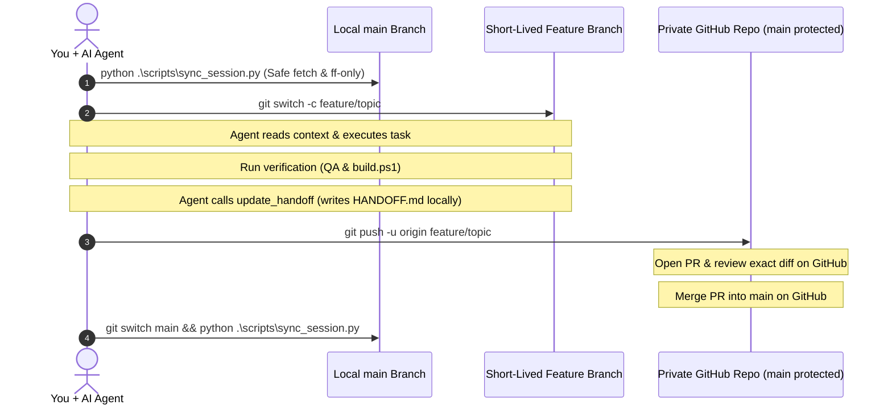

# Vanguard Web Studio: Partner Quickstart & Onboarding Guide

Welcome to **Vanguard Web Studio**. This guide walks you through setting up our shared workspace on your machine and connecting your AI assistant (Claude Desktop, Cursor, Antigravity, or Claude Code) in **under 3 minutes**.

---

## 1. Initial Setup (One-Time)

### Step 1: Clone the Private Repository
Clone the private repository to your preferred local folder:
```powershell
git clone https://github.com/Hanzam14/client-web-business.git
cd client-web-business
```
*(You can place this folder anywhere on your computer—the setup script automatically detects the location).*

### Step 2: Run the Automated Bootstrap
Run our cross-platform setup script in your terminal:
```powershell
python .\scripts\setup_partner.py
```
*(Or via PowerShell: `powershell -ExecutionPolicy Bypass -File .\scripts\setup_partner.ps1`)*

#### What the Bootstrap Script Does Automatically:
- Checks for Python 3.8+ on your system.
- Backs up your existing Claude Desktop configuration (`claude_desktop_config.json.bak_<timestamp>`).
- Merges the `vanguard-icm` MCP server into your Claude configuration without touching your other servers.
- Generates `.cursor/mcp.json` tailored to your local path.
- Runs an automated verification check to confirm everything is working.

### Step 3: Restart Your AI Client
- **Claude Desktop**: Fully close Claude from your system tray/taskbar, then reopen it.
- **Cursor**: Open the `client-web-business` folder in Cursor.
- Look for the 🔨 tool/hammer icon. You will see the `vanguard-icm` toolset registered.

---

## 2. Daily Collaboration Workflow

We share context and work through the **Handoff Baton on `main`** (`HANDOFF.md`).

`main` is protected on GitHub to prevent accidental direct pushes. All changes merge through short-lived feature branches and Pull Requests.



### The 5-Step Rhythm
1. **Safe Sync**: Run the start-of-session synchronization tool:
   ```powershell
   python .\scripts\sync_session.py
   ```
   *(Or on Windows PowerShell: `powershell -ExecutionPolicy Bypass -File .\scripts\sync_session.ps1`)*  
   This safely fetches from origin, inspects your partner's new commits, fast-forwards cleanly (`--ff-only`), and prints the 30-second briefing.
2. **Start Session**: Open your AI assistant in the workspace. Prompt:
   > *"Call get_icm_context and summarize the current next action."*
3. **Branch**: For all code, demo, or style modifications, create a task branch:
   ```powershell
   git switch -c feature/your-feature-name
   ```
4. **Test**: Compile and verify before merging:
   ```powershell
   .\build.ps1 -Mode Preview
   ```
5. **Handoff, Push & PR**:
   - Have your agent write the updated handoff: *"Call update_handoff with what we completed and what comes next."*
   - Commit and push your branch:
     ```powershell
     git add <changed-files>
     git commit -m "feat(demos): implement feature and update handoff"
     git push -u origin feature/your-feature-name
     ```
   - Click the Pull Request link GitHub outputs to review the diff and merge into `main` on GitHub.
   - Switch back to `main` locally, delete the local feature branch, and pull the latest approved state:
     ```powershell
     git switch main
     git branch -d feature/your-feature-name
     python .\scripts\sync_session.py
     ```

---

## 3. MCP Toolset Reference

Your AI assistant has access to these 8 bounded tools:

| Tool | Purpose | When to Use |
| :--- | :--- | :--- |
| `get_icm_context` | Loads `AGENTS.md`, `CONTEXT.md`, `HANDOFF.md`, and `COLLABORATION.md`. | Always run at the start of a session. |
| `list_workspace_files` | Returns a clean file tree with SHA256 hashes. | Discovering project demos, contracts, and assets. |
| `read_workspace_file` | Reads any file safely with SHA256 checksum. | Inspecting specific code, tokens, or contracts. |
| `write_workspace_file` | Atomic write with path safety & local concurrency check (`expected_sha256`). | Writing new demos, proposing edits, adjusting styles. |
| `update_handoff` | Formats and writes the 5-field handoff to `HANDOFF.md` locally (does NOT run git commit). | Updating handoff before pushing branch or PR. |
| `get_workspace_status` | Returns Git branch, commit, and modified files. | Checking working tree state without shell scripts. |
| `get_sync_status` | Summarizes upstream commits and files changed by partner. | Checking if partner pushed new work to GitHub. |
| `export_zip_packet` | Creates a clean, stripped zip bundle in `backups/`. | Optional offline backup or frozen snapshot. |

---

## 4. Troubleshooting

### Problem: "running scripts is disabled on this system" (PSSecurityException)
Windows disables running unsigned `.ps1` scripts by default. Run the python script directly instead:
```powershell
python .\scripts\setup_partner.py
```
Or bypass execution policy for that one command:
```powershell
powershell -ExecutionPolicy Bypass -File .\scripts\setup_partner.ps1
```

### Problem: "Python was not found"
- Install Python 3.8+ from [python.org](https://www.python.org/downloads/) or the Windows Store.
- During installation, **check the box: "Add python.exe to PATH"**.

### Problem: MCP tools do not show up in Claude Desktop
1. Check the Claude log file:
   - On Windows: `%APPDATA%\Claude\logs\mcp*.log`
2. Run manual verification to see exact failure:
   ```powershell
   python .\scripts\verify_mcp.py
   ```
3. Ensure Claude Desktop was completely quit (not just minimized to system tray) and restarted.

### Problem: "STALE_VERSION_CONFLICT" error when writing
- A local file was modified on disk since your AI read it.
- **Fix**: Have your agent re-read the file with `read_workspace_file` to fetch the new content and SHA256, then re-apply changes.

### Problem: "PROTECTED_FILE_LOCKED" error
- Files like `AGENTS.md`, `contracts/**`, `vercel.json`, and `build.ps1` are locked to prevent accidental AI rewrites.
- **Fix**: If you deliberately intend to modify a protected file, pass `"allow_protected": true` in the tool call arguments.

### Problem: Git merge conflict on PR
- If both partners modified the same file or `HANDOFF.md`:
  1. GitHub will show that the branch has conflicts that must be resolved.
  2. Pull the latest `main` into your feature branch (`git fetch origin && git merge origin/main`).
  3. Open the file, keep the correct combined code/handoff, remove conflict markers (`<<<<<<<`, `=======`, `>>>>>>>`).
  4. Commit and push: `git commit -m "docs: resolve merge conflict"` and `git push`.
